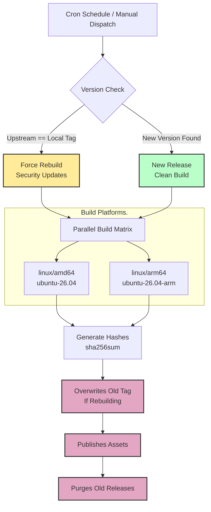

# MediaInfo-Builds
MediaInfo Builds For ARM64 & AMD64

# Automated MediaInfo Compiler

An optimized, cloud-native automation pipeline that monitors upstream releases of MediaInfo and automatically builds standalone, highly portable static binaries for **linux/amd64** and **linux/arm64** architectures.

---

## 🚀 Key Features

* **Native Multi-Architecture Compilation**: Avoids slow QEMU emulation overhead by utilizing GitHub’s native AMD64 and ARM64 runners.
* **Minimalistic & Highly Portable**: Compiled exclusively against critical system dependencies (`zlib1g-dev`) to maximize static binary portability across various Linux environments.
<!-- ❌ Delete This Block Later, When Re-Enable Caching. ❌
* **Robust Docker Remote Caching**: Implements `--cache-to/from type=gha` layers to guarantee subsequent code builds complete within minutes. -->
* **Automatic Security Checksums**: Every build dynamically computes and attaches an authoritative `SHA256SUMS` verification manifest to the GitHub Release.
* **Autonomous Pipeline Maintenance**: Integrated self-cleaning logic stores only the latest 4 production releases while automated keepalive protocols prevent GitHub Actions from sleeping.

---

## ⚙️ Automated Pipeline Policies

### 🕒 Build Schedule
* **Execution Interval**: Builds trigger automatically every week at **11:50 PM UTC On Tuesdays, Thursdays & Saturdays**, as well as on manual execution via `workflow_dispatch`.
* **Smart Verification**: The compiler checks upstream releases first. If a brand-new upstream version of `MediaInfo` is detected, a **Clean Build** is triggered. If no upstream updates exist, the workflow automatically force-rebuilds the current version to apply the latest security patches to all bundled dependencies.

### 💻 Target Architectures
This project focuses explicitly on delivering high-performance, optimized **64-bit Linux environments**. 
* **Supported Architectures**: Standalone native binaries are compiled for **linux/amd64** (`x86_64`) and **linux/arm64** (`aarch64`).
* **Non-Supported Environments**: There are no active automated builds for Windows or 32-bit platforms. However, you can use the provided standalone `Dockerfile` to manually compile your target configurations locally.

### 🗑️ Release Retention Policy
To prevent repository bloat while maintaining quick access to stable historical versions, the pipeline enforces a strict self-cleaning cycle:
* **The Last 4 Releases Are Kept**: The cleanup script evaluates the storage history on every successful release and retains exactly the **4 most recent production versions**.
* **Automatic Tag Purging**: Releases older than the top 4 are automatically removed along with their corresponding git repository tags.
* **Deterministic Version Tags**: Releases use explicit upstream version naming conventions (e.g., `v24.11`), allowing you to anchor your production scripts to unchanging, specific versions.

---

## 🛠️ Infrastructure Overview

---